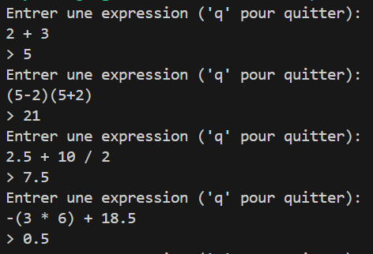

# Interpreteur_Calculs_OCaml

[](#)

Ce projet est une calculatrice interactive écrite en OCaml. Elle permet d'interpréter des expressions mathématiques (tokenisation et parsing), puis de les évaluer.

La saisie utilisateur est convertie en liste de tokens par le lexeur, les tokens sont transformés dans un arbre syntaxique d'une grammaire formelle, et l'arbre est évalué pour afficher le résultat.

Projet d'apprentissage et d'expérimentation avec OCaml.



## Grammaire

```
expr = expr * (ADD | SUB) * term | term
term = term * (MUL | DIV) * factor | factor
factor = unary
unary = (NEG) * unary | primary
primary = float | expr
```

## Features 

- Opérations standards `+`, `-`, `*`, `/`.
- Priorité des opérations.
- Parenthèses `(`, `)` et multiplication implicite.

## Lancer le programme

Utiliser le build `dune`.

```sh 
dune build
dune exec ./bin/main.exe
```

Ou bien utiliser le script qui build et clean.
```sh
./compile.sh
```

# Note de développement 

Quelques ressources utiles : 
- https://craftinginterpreters.com 
- https://pages.cs.wisc.edu/~fischer/cs536.s06/course.hold/html/NOTES/4.SYNTAX-DIRECTED-TRANSLATION.html 
